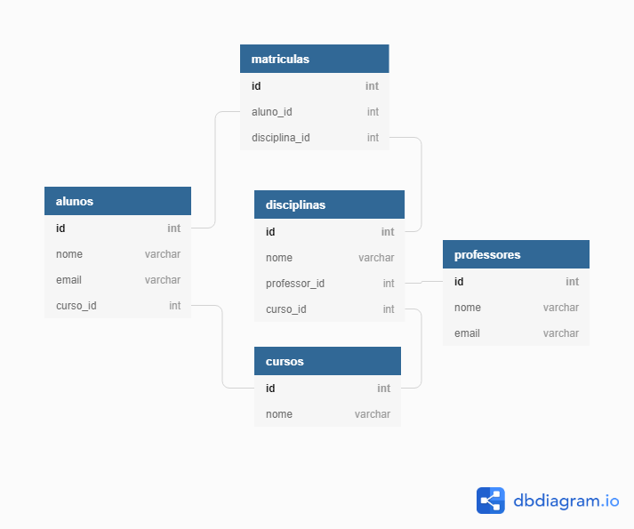

# SISAR :mortar_board:

> SISAR é um projeto de gestão acadêmica feito para a disciplina de Desenvolvimento Web II com PHP Laravel, visando explorar a utilização do Eloquent ORM :mortar_board:
> 
> [Descrição da Atividade 09 sobre Eloquent ORM](http://www.gileduardo.com.br/ifpr/dwii/downloads/dwii_pratica09.pdf)
## Instalando o projeto :white_check_mark:
1. Clone o repositório
2. Entre no diretório `src`
3. Instale as dependências do Composer: `composer install`
4. Copie o arquivo `.env.example` para `.env`
5. Configure as variáveis de ambiente no arquivo `.env`
6. Crie uma nova chave para o projeto Laravel: `php artisan key:generate`
7. Instale as dependências do Node: `npm install`
8. Compile os assets: `npm run dev`
9. Inicie o servidor: `php artisan serve`
## Persistência

> ### Projeto desenvolvido para a disciplina de **Desenvolvimento Web II** :books: